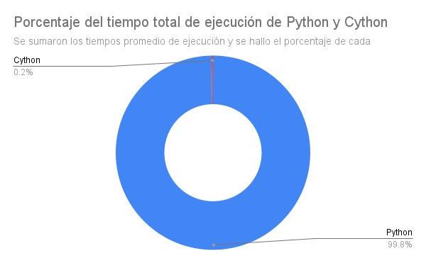
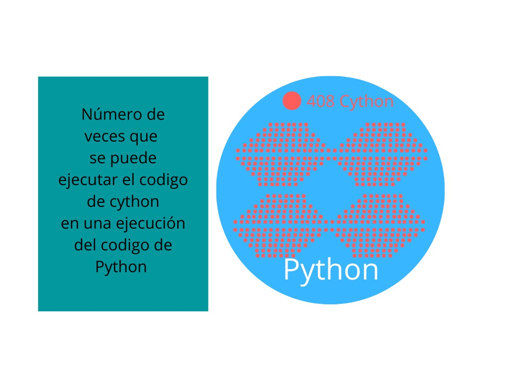

## Medidas de rendimiento y perfilamiento de la Ecuacion de calor entre Python y Cython
La ecuación de calor (o difusión) es una ecuación diferencial parcial que describe cómo la
la temperatura varía en el espacio con el tiempo.
La solución numérica de la ecuación de calor contiene aspectos de desempeño que son
presente también en muchos otros problemas y, como tal, la ecuación de calor se utiliza como un
ejemplo en varios ejercicios prácticos a lo largo del curso.


El archivo test.py ejecuta las iteraciones para Python y Cython


### Perfilamiento para Cython
Se realizó un archivo `.pyx` con una implementación simple en Cython del archivo `heat.py` con el fin de comparar resultados en cuanto a tiempo de ejecucion. 

Para generar el archivo `.c` dado un archivo `.pyx`, se creó un archivo denominado `setup.py`, en el que se indica el archivo a "cythonizar".

Ahora, se ejecuto la siguiente linea de codigo:
```
python3 setup.py build_ext --inplace
```
como resultado se obtiene la conversion de el archivo heat.py a C y un archivo `.so`. 

Resultados







### Conclusiones

* Mientras mas grande o complejo sea el algoritmo en python, su diferencia en cuanto a rendimiento va a ser proporcional a la complejidad del mismo junto con la biblioteca `timeit` para comparación de tiempos.


* Aunque las implementaciones en Cython mejoran el rendimiento respecto a las de Python se puede ver que desarrollar los algoritmos de Cython toman más tiempo y tienen un grado mayor de complejidad a la hora de desarrollarlos, además se deben tener conocimientos sobre los fundamentos del lenguaje de programación C.


* Las optimizaciones que se pueden llevar a cabo a los códigos de Python mediante el uso de Cython dependen de la cantidad de modificaciones que se le hagan al código original de Python y a cuantas variables y funciones se les puede dar una declaración de tipo de variable. Además se hace necesaria la utilización de librerías desarrolladas en el lenguaje de Cython debido a que hay variables y funciones a las que todavía no se les puede dar una traducción de Python a Cython de manera simple.tiempo. 

* Desde el punto de vista de los usuarios de los algoritmos o el cliente final de estos se puede decir que la utilización de Cython agiliza y concede menores tiempos de espera en los programas, por lo que tiene una relación directa con la experiencia de usuario y puede mejorarla de manera que el cliente aproveche su tiempo y no se estrese o pierda el interés en los programas que los desarrolladores hacen.

### 
* Leonardo Omeara
* Erika Romero
* Michael Pinzon
* Juan Arteaga
* Johan Herrera


 _Universidad Sergio Arboleda_